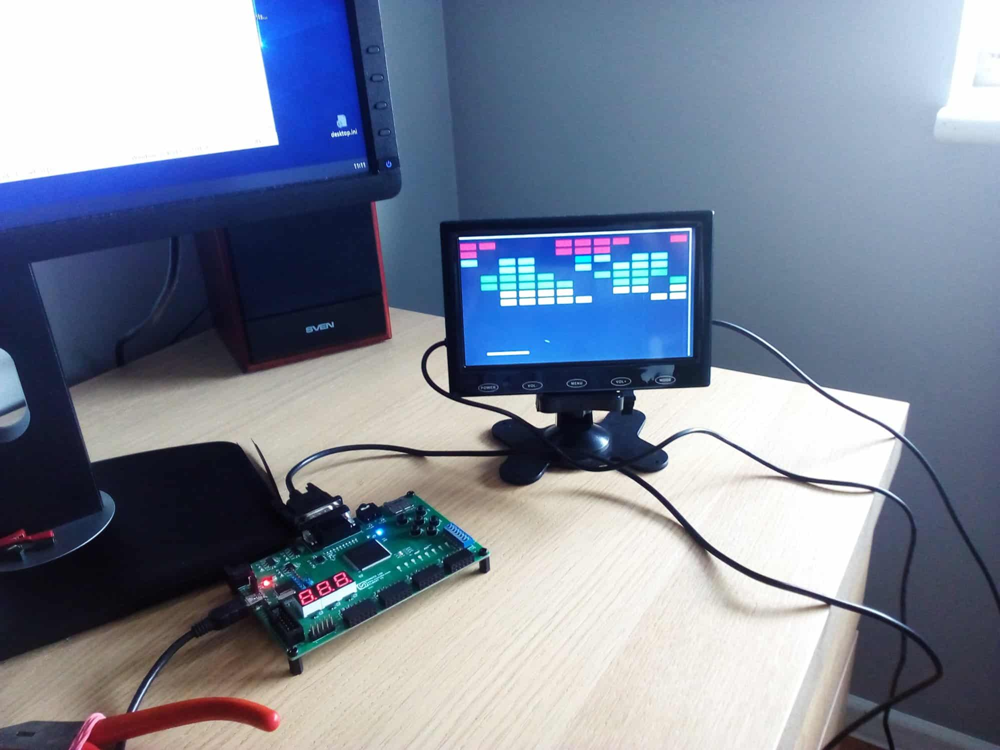

# Arkanoid-game-Elbertv2-fpga
### Arkanoid (Verilog) game implementation for `Elbert v.2` FPGA board

The target hardware for this Arkanoid implementation is the `Numato LAB` FPGA kit
[Elbert v.2 Spartan3 FPGA board](https://numato.com/product/elbert-v2-spartan-3a-fpga-development-board/)

### Project description
Because I grew up in the 1980s (I started high school in 1981) I spent a lot of time playing simple games on "slot machines" (in my town then there were three large arcades and a lot of separate machines). One of my favorite games back then was "Breakout" (also known as Arkanoid) so I decided to look to see if some version of this game would run on the FPGA set. I found two implementations of this game: one extended with many levels and nice graphics - but its implementation was based on a soft-processor and consuming a lot of FPGA resources, while the other was very simple implemented in the "ordinary logic blocks" of the FPGA and consuming little resources. I decided to run the second very simple implementation (one level of the game) on the ElbertV.2 FPGA set.

The entire project was based on the code from this website:
[Breakout-Game](https://www.instructables.com/Breakout-Game/)

In this repository in catalog `Xilinx_ISE_14.7_Project`is placed all `Xilinx ISE
14.7 Webpack` project with game code.

Verilog code is placed in subdirectory `src`, but `User constraint` file is in main catalog in file titled `breakout.ucf` (for Elbert v.2 FPGA)

To adapt the game to the Elbert set, several modifications had to be made:

1) Add a new clock which, based on the 12MHz clock from Elbert, generated a 50 MHz clock (this was the clock used in the original design)

2) Fix the bug in the main module "breakout.v" related to the buffer for the 25MHz clock (for the clocking of the VGA display)

3) Disregard the game reset signals (de) and the movement of the rota and rotb paddles

4) Change the paddle handling process (so that you can use two buttons from the Elbert set)

5) Adapt the "user constraints" file to the Elbert V.2 kit

But in turn:

IPCore (clock module) PLL_1 - Clock12Mhz instance has been added and the code of the main project module (breakout.v) has been changed as follows:

Original code:
```verilog
module breakout (

    input clk50 , 
    input rota , 
    input rotb , 
     input de , 
    output red , 
    output green , 
    output blue , 
    output hsync ,
    output vsync
    ); 
reg clk25_int ; 
always @ ( posedge clk50 ) begin
               clk25_int <= ~ clk25_xx ; 
end
wire clk25 ; 
BUFG bufg_inst ( clk25 , clk25_xx ); 
wire [ 9 : 0 ] xpos ; 
wire [ 9 : 0 ] ypos ; 
signal_generator signal_generator_inst ( clk25 , hsync , vsync , xpos , ypos ); 
game game_inst ( clk25 , xpos , ypos , rota , rotb , de ,red , green , blue );                                                                  

endmodule
```
After modyfication:
```verilog
module breakout (

    input clk12 , // clk50 was 
    input rota , 
    input rotb , 
    input de , 
    output red , 
    output green , 
    output blue , 
    output hsync , 
    output vsync
    );
	 
wire clk50 ; 	 
wire clkInBuf , clkOut ; 
reg clk25 ;

// Instantiate the module PLL-Clock 
PLL_1 Clock12MHz ( . CLKIN_IN ( clk12 ) ,. CLKFX_OUT ( clk50 ) ,. CLKIN_IBUFG_OUT ( clkInBuf ) ,. CLK0_OUT ( clkOut ) ); 
     
always @ ( posedge clk50 ) begin
               clk25 <= ~ clk25 ; 
end

wire [ 9 : 0 ] xpos ; 
wire [ 9 : 0 ] ypos ;

signal_generator signal_generator_inst ( clk25 , hsync , vsync , xpos , ypos ); 
game game_inst ( clk25 , xpos , ypos , ~ rota , ~ rotb , ~ de , red , green , blue );                                                                     

endmodule
```
In the "game.v" module, the paddle handling has been completely modified:

Was:
```verilog
// paddle movement   
reg [ 8 : 0 ] paddlePosition ; 
reg [ 2 : 0 ] quadAr , quadBr ; 
always @ ( posedge clk25 ) quadAr <= { quadAr [ 1 : 0 ], rota }; 
always @ ( posedge clk25 ) quadBr <= { quadBr [ 1 : 0 ], rotb }; 
always @ (  posedge clk25 ) if ( quadAr [ 2 ] ^ quadAr [ 1 ] ^ quadBr [ 2 ] ^ quadBr [ 1 ])
   
begin
 if ( quadAr [ 2 ] ^ quadBr [ 1 ]) begin
   if ( paddlePosition < 520 ) // movement range 
   paddlePosition <= paddlePosition + 3 ; // velocity of the paddle            
   
 end
 else begin
   if ( paddlePosition > = 0 ) // movement range 
   paddlePosition <= paddlePosition - 3 ; // velocity of the paddle             
 end
end
```
After modification:
```verilog
// paddle movement   
reg [ 8 : 0 ] paddlePosition ; 
reg [ 27 : 0 ] counter ;

always @ ( posedge clk25 )
begin
  counter <= counter + 1 ; if ( counter == 250 _000 ) 
    
    begin
      counter <= 0 ; 
                
if ( rota || rotb )
begin
 if ( rota ) begin
   if ( paddlePosition < 520 ) // movement range 
   paddlePosition <= paddlePosition + 3 ; // velocity of the paddle           
   
 end
 else if ( rotb ) begin
   if ( paddlePosition > = 0 ) // movement range 
   paddlePosition <= paddlePosition - 3 ; // velocity of the paddle              
 end
end
 
end
end
```
The paddle handling is now supported by two "switches" sw4 and sw6 from the Elbert board with a frequency of about 100Hz (hence the added counter in the process).

And it remains to adjust the file "breakout.ucf" to the Elbert set, which looks like this:
```code
# Clock 12 MHz 
NET "clk12"   LOC = P129   | IOSTANDARD = LVCMOS33 | PERIOD = 12MHz ; 
 
#VGA pins 
NET "hsync" LOC = "P93" | IOSTANDARD = LVCMOS33 | DRIVE = 12 | SLEW = FAST ;                                              
NET "vsync" LOC = "P92" | IOSTANDARD = LVCMOS33 | DRIVE = 12 | SLEW = FAST   ;                                         
NET "red"    LOC = "P105" | IOSTANDARD            = LVCMOS33 | DRIVE = 12 | SLEW = FAST ;                                            
NET "green" LOC = "P102" | IOSTANDARD = LVCMOS33 | DRIVE = 12 | SLEW = FAST ;                                             
NET "blue"   LOC = "P98" | IOSTANDARD = LVCMOS33 | DRIVE = 12 | SLEW =           FAST ;

#Padd pins
                                          
NET "rota"    LOC = "P77" | IOSTANDARD = LVCMOS33 | PULLUP    ; # sw6 
NET "rotb"    LOC = "P75" | IOSTANDARD = LVCMOS33 | PULLUP ; # sw4                
                                                                           
NET "de"      LOC = "P80" | IOSTANDARD = LVCMOS33 | PULLUP ; # sw1         
```
The game running on the Elbert FPGA set looks like this (on a 10-inch VGA monitor)


